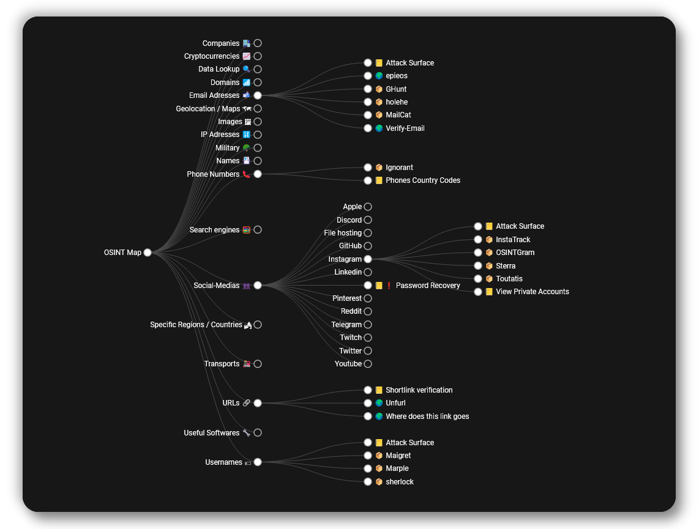

# 🕵️‍ Malfrat's OSINT Map
<!--

-->
## [🗺 Available here !](https://map.malfrats.industries)

[**Malfrat's OSINT Map**](https://map.malfrats.industries) is **an online tree** of selected useful tools **made for OSINT** purposes,\
made to **help you during your investigations** 👀

_It is an up-to-date and remastered version of osintframework.com, who isn't updated anymore._

## 🏁 Legend
Emoji | Signification
:-: | :-:
📦 | **A tool requiring to be installed**
💵 | **Inefficient tool without purchases**
🌍 | **An online tool or service**
📒 | **A guide, tutorial or documentation**
🪙 | **Useful tool even without purchases**
🧅 | **Leading to a `.onion` website**
🧩 | **A web browser extension**
❗️ | **Offensive-OSINT that might alert the target**

## 📥 Add a tool
To add a tool to the map, follow [this guide](https://github.com/Malfrats/OSINT-Map/blob/main/ADD.md).

## 📢 For Update Notifications
Twitter -> [@malfratsind](https://twitter.com/malfratsind)\
Discord -> [Malfrats Industries](https://discord.gg/r3GMnHVx5H)\
Watch or star [the project](https://github.com/malfrats/osint-map) on Github